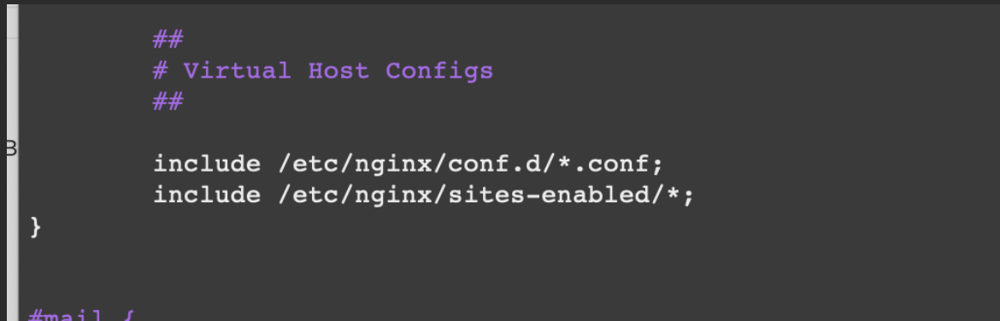
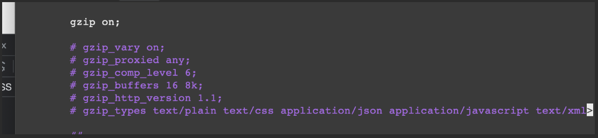
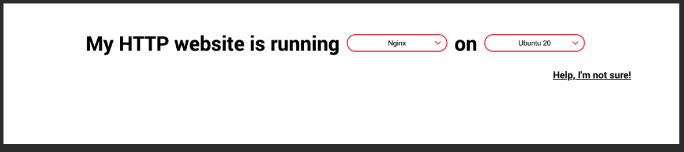

[Открыть видео](https://www.youtube.com/watch?v=8OHe6chCWTE&t=315s)

[Статься от автора](https://selectel.ru/blog/tutorials/deploy-with-nginx/?utm_source=youtube.com&utm_medium=referral&utm_campaign=help_deploy-with-nginx_210823_ulbi-tv_paid)


1) аренда сервера

- `ssh root@84.54.47.51` (дальше пароль)
- `sudo apt update` (Обновляем пакеты)

- Устанавливаем GIT - (ищем ubuntu install git) - `sudo apt install git-all`
- Устанавливаем NPM - (ищем nvm ubuntu install) Установили в папке
  проекта - `curl -o- https://raw.githubusercontent.com/nvm-sh/nvm/v0.39.5/install.sh | bash`
  -> для того чтобы он заработал надо добавить переменную
  окружения. - `export NVM_DIR="$([ -z "${XDG_CONFIG_HOME-}" ] && printf %s "${HOME}/.nvm" || printf %s "${XDG_CONFIG_HOME}/nvm")"
  [ -s "$NVM_DIR/nvm.sh" ] && \. "$NVM_DIR/nvm.sh"` - Теперь все должно работать

`nvm - это для того чтобы управлять гибко версиями nodejs.`

- Установка NodeJs - `nvm install 18.16.1`
- Устанавливаем пакеты - `npm i`
- Делаем сборку - `npm run build`

---

Теперь нам нужно каким-то образом (index.html), донести до пользователя. Чтобы он перешел на наш домен. И чтобы какой-то
сервер, ему отдал эту статику.

Для этого будем использовать `nginx`

- Установка nginx:  `sudo apt install nginx`

`nginx` - это веб-сервер. Прост в использовании, гибкий, конфигурируемый. И который можно использовать для раздачи
статических файлов. `apache` - такой же веб-сервер. 

- Заходим в папку `etc` -> `etc/nginx` = открываем файл конфигурации -> `nano nginx.conf`



Внизу файла. Где 2 include. В них подключатся дополнительные конфиги, которыми мы можем расширить главный конфиг.

просмотрели файлы и вышли.

- Зашли в папку - `cd sites-enabled`
- `nano default`

```js
server {
        listen 80 default_server; // Говорит что мы будем прослушивать 80 порт. Этот порт является по умолчанию для HHTP.
        listen [::]:80 default_server;

        root /var/www/html; // путь к папке в которой будут распологаться статические файлы.  

        index index.html index.htm index.nginx-debian.html; // Название энтрипоинтов. 

        server_name _; // сервер найм.

        location / { 
          // в ней идет работа с URL. Здесь можно делать редиректы. Проксирование. Перенаправлять запросы. Обрабатывать qery параметры.
          // запрашиваем файлы, если их нет возвращаем 404.
             try_files $uri $uri/ =404;  
        }
}
```
- в файле меняем `root /var/www/html;` -> `root /var/www/dist;`
- `cd var/www` -> Удаляем HTML file -> `rm -rf html`
- `cd ~`
- `npm run build` 
- Появилась папка "dist". Дальше нам нужно ее переместить в `var/www/`
- `mv dist ../../var/www`
- надо перезагрузить nginx -> `sudo service nginx restart`

! Была ошибка. Порт 80 был занят. Я поставил 8080


> Если в URL будет ошибка. Он по этому пути будет запрашивать файл. ФАйл он не найдет, потому-что у нас 1 index.html. Т.е. у нас SPA на react.
>  Это одностраниченое приложение. И для того чтобы он всегда запрашивал index.html нам необходимо сделать проксирование запросов всегда на index.html
```js
location / { 
          // в ней идет работа с URL. Здесь можно делать редиректы. Проксирование. Перенаправлять запросы. Обрабатывать qery параметры.
          // запрашиваем файлы, если их нет возвращаем 404.
             try_files $uri $uri/ /index.html;  
          // =404 убрали
        }
```
> Если у вас классическое многостраничное приложение. Где много html файлов. То тогда проксирование делать НЕ нужно.


***

- Можно оптимизировать сжатие бандла спомощью `nginx`. Дополнительно спомощью модуля `gzip`. Это классическое сжатие файлов. Nginx их сжимает, отправляет браузеру и браузер их разворачивает.
- Для того чтобы `gzip` работал надо в файлу nginx.conf разоментирова эти строки

```js
gzip_comp_level 6; // Это уровень сжатия. Того на сколько грубо он сжимает ваши файлы. Всего уровней 9 (кажется)


```

***

Подключение домена
 
[link - видео](https://www.youtube.com/watch?v=8OHe6chCWTE&t=315s)

Я пропустил подключение домена


***
Настройка сертификата

1) Заходим на сайта - https://letsencrypt.org/getting-started/ 
2) Нажимаем на Certbot - https://certbot.eff.org/ - Бот который может сгенерировать сертификаты7



3) `sudo apt-get remove certbot` - удаляем прошлого бота
4) Установка - `sudo snap install --classic certbot`
5) `sudo ln -s /snap/bin/certbot /usr/bin/certbot` - должны находиться в корневой дирректории `cd /`
6) Объеденяем бот с nginx `sudo certbot --nginx`


ДОСМОТРЕТЬ! 

